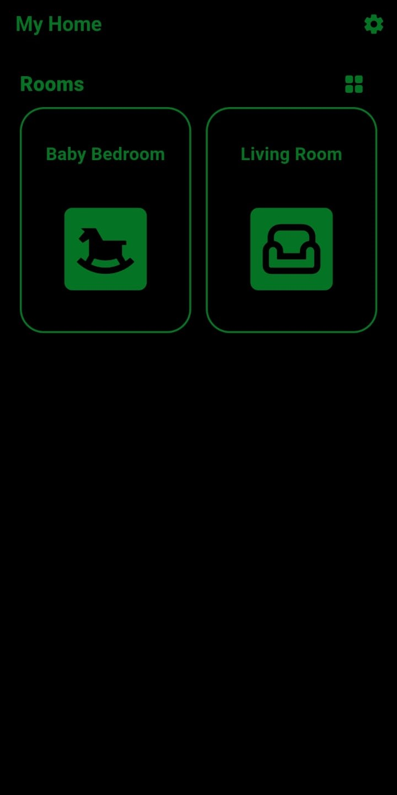
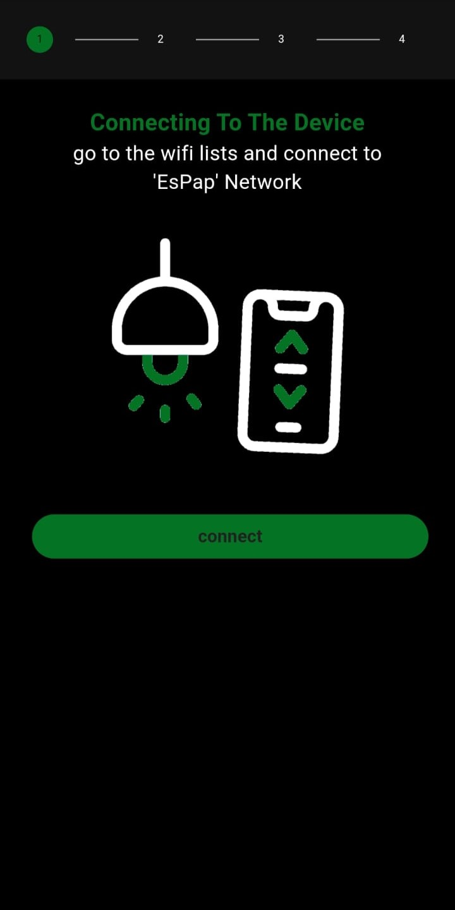
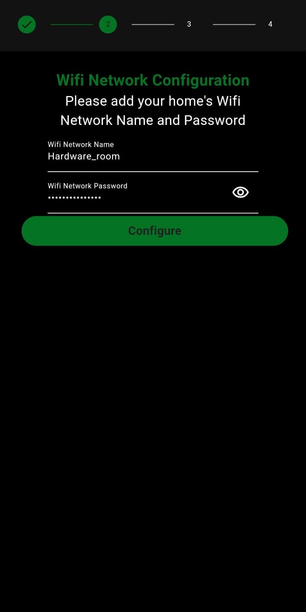
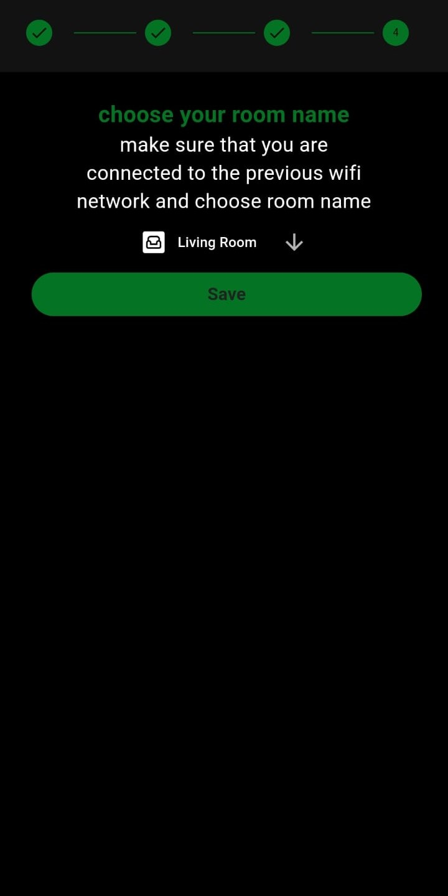

# Smart Home Light Control Application

## Overview
GlowGrid is an Android application that allows users to control light switches through a Wi-Fi network. 
The app provides simple on/off control of switches and allows users to adjust the color of one LED light. 
Users can manage devices across different rooms and share settings between mobile devices via QR 
code. 

## Features
- Control of multiple light switches 
- RGB color control for one LED 
- Device sharing via QR code 
- Room and device management 
- Dark and light theme options 

## Permissions
- Camera (for QR code scanning during device sharing).

## Usage
- Connect to Your Device: Open the app and connect to your smart lighting system via Wi-Fi.
- Navigate Through Rooms: Select rooms from the app's interface to control specific lights.
- Toggle or Dim Lights: Use on-screen switches and sliders to adjust the lighting as desired.

## Technologies Used
- Frontend: Flutter (Dart)
- Backend: Firebase (for data storage and real-time updates) [if applicable]
- Connectivity: Wi-Fi

## Project Structure
- /lib: Main codebase with widgets, models, and services
- /images: Contains images and icons for the app

## screenshots
Here is a glimpse of the smart Home Light Control Application:

### Main Dashboard

### Light Control Page

### Device Configuration Page
- step 1:

- step 2:

- step 3:

- step 4:

### Export Data Page

### Import Data Page

## License
This project is licensed under the GNU Affero General Public License v3.0.